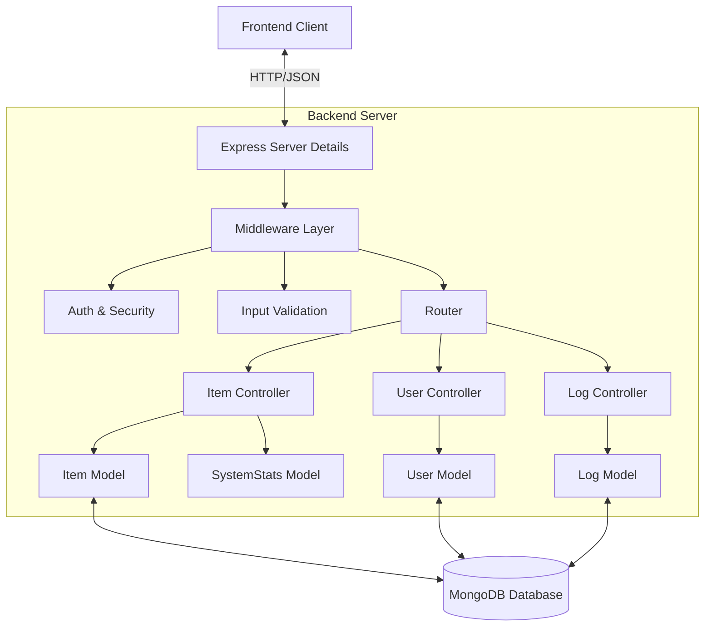

# Backend Progress Report: Inventory Manager Project

This report details the comprehensive development progress of the backend API for the Inventory Manager project. The system is built as a robust, RESTful API using Node.js and Express, designed to serve securely as the data backbone for the frontend application.

## 1. Project Overview
The **Inventory Manager Backend** is a scalable server-side application that manages persistent data storage, authentication, and business logic. It connects to a MongoDB database to offer reliable CRUD operations, complex statistical calculations, and secure user management via JSON Web Tokens (JWT).

## 2. Objectives Met
The following key objectives have been successfully implemented:

*   **RESTful API Architecture**: A clean, organized set of endpoints (`/api/auth`, `/api/items`, etc.) following standard HTTP methods (GET, POST, PUT, DELETE).
*   **Database Persistence**: Full integration with **MongoDB** via Mongoose, ensuring data survives server restarts.
*   **Secure Authentication**: Implementation of **JWT (JSON Web Token)** based authentication.
    *   Passwords are securely hashed using `bcryptjs` before storage.
    *   Protected routes verify tokens before granting access.
*   **Role-Based Access Control (RBAC)**: Middleware that restricts sensitive endpoints (like creating or deleting items) to authorized roles (`site_admin`, `editor`).
*   **Automated Audit Logging**: A centralized logging system that automatically records every critical action (Create, Update, Delete) into a `Log` collection, ensuring accountability.
*   **Trend Tracking System**: A smart statistics engine that monitors inventory value changes over time to calculate trends (Increase/Decrease/Neutral) for the dashboard.

## 3. System Architecture

The backend follows a **Controller-Service-Model** pattern to ensure separation of concerns and maintainability.

*   **Runtime Environment**: Node.js
*   **Web Framework**: Express.js
*   **Database**: MongoDB (via Mongoose ODM)
*   **Authentication**: Passport / JWT strategies
*   **Key Dependencies**:
    *   `mongoose`: Data modeling and validation.
    *   `bcryptjs`: Password encryption.
    *   `jsonwebtoken`: Stateless session management.
    *   `cors`: Cross-Origin Resource Sharing handling.

### Architecture Diagram

## 4. Detailed Activity Report

### A. API Core Configuration (`server.js`)
The entry point of the application handles:
*   **Database Connection**: Asynchronous connection to MongoDB with auto-retry logic.
*   **Global Middleware**: CORS setup (allowing requests from the frontend), JSON body parsing, and request logging in development mode.
*   **Auto-Seeding**: A smart initialization script that checks if the user database is empty and auto-generates a default Admin account if needed, streamlining deployment.

### B. Intelligent Business Logic (`controllers/itemController.js`)
This controller contains the core logic for inventory management:
*   **CRUD Operations**: Handlers for fetching, creating, updating, and deleting items.
*   **Trend Calculation**: The `updateTrends` helper function runs after every modification. It compares current total values against the last snapshot to determine if stock/value is trending up (`increase`) or down (`decrease`).
*   **Transactional Integrity**: When an item is modified, the controller *simultaneously* updates the item document, creates a log entry, and recalculates system stats.

### C. Security & Authentication (`controllers/authController.js`)
*   **Registration**: Validates input and checks for duplicate usernames.
*   **Login**:
    *   Verifies credentials against the hashed password.
    *   Issues a signed JWT containing the user's ID and Role.
*   **Password Hashing**: Uses `bcryptjs` with a salt round of 10 to ensure even if the database is compromised, passwords remain secure.

### D. The Audit System (`models/Log.js` & `controllers/logController.js`)
A critical feature for accountability.
*   **Data Structure**: The Log model captures:
    *   `action`: (ADD, UPDATE, DELETE)
    *   `userId` & `username`: Who performed the action.
    *   `details`: A human-readable summary.
    *   `reason`: The user-provided justification.
    *   `previousData` / `newData`: Snapshots of the item before and after changes (for detailed diffs).
*   **Immutability**: Logs are designed to be append-only to preserve the integrity of the audit trail.

### E. System Statistics (`models/SystemStats.js`)
A specialized singleton model designed to store high-level dashboard data.
*   Instead of recalculating total value from scratch on every dashboard load (which is expensive), the backend maintains a cached state of `totalItems`, `totalQuantity`, and `totalValue`, updating it only when writes occur.

## 5. Summary
The backend implementation provides a secure, high-performance foundation for the Inventory Manager. By handling complex logic (like trend calculation and auditing) on the server, it keeps the client lightweight and ensures data integrity regardless of how the API is accessed. The modular structure allows for easy extension, such as adding new resource types or integrating third-party services in the future.
