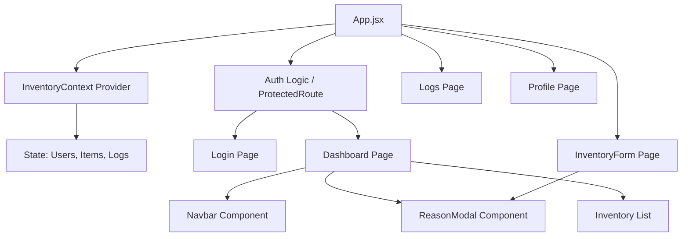

# Frontend Progress Report: Inventory Manager Project

This report details the comprehensive development progress of the frontend application for the Inventory Manager project. The system has been built as a modern Single Page Application (SPA) designed to manage inventory items, track stock changes, and maintain accountability through audit logs.

## 1. Project Overview
The **Inventory Manager** is a React-based web application providing a centralized interface for tracking product stock, values, and user activities. It features a robust role-based access control system (Admin, Editor, Viewer) and simulates a backend environment using local storage and React Context for persistent state management.

## 2. Objectives Met
The following key objectives have been successfully implemented:

*   **User Authentication & Security**: Setup of a login system with persistent sessions and `ProtectedRoute` wrappers to restrict access to authorized users only.
*   **Inventory Management (CRUD)**: Full capability to Create, Read, Update, and Delete inventory items.
*   **Accountability & Auditing**: Implementation of a "Reason" system. Every actionable change (Add, Update, Delete) forces the user to provide a justification (e.g., "Restock", "Damaged", "Sold").
*   **Audit Trail**: A dedicated **Logs** page that records every transaction (Who, What, When, Why) to ensure transparency.
*   **Role-Based Access Control (RBAC)**:
    *   **Viewers**: Can only view the dashboard and logs.
    *   **Editors/Admins**: Can add, edit, or delete items.
*   **Profile Management**: Functionality for users to update their personal details (Username, Full Name) with uniqueness checks.

## 3. System Architecture

The frontend is built on a modern stack designed for performance and maintainability:

*   **Core Framework**: React 19 w/ Vite 7.
*   **Routing**: `react-router-dom` (v7) handles client-side routing.
    *   **Routes**: `/login`, `/dashboard`, `/logs`, `/profile`, `/inventory/add`, `/inventory/edit/:id`.
*   **State Management (The "Brain")**:
    *   **InventoryContext**: acts as the central store for the application. It manages:
        *   `user`: Current session state.
        *   `items`: Inventory data array.
        *   `logs`: Audit trail history.
        *   `dbUsers`: Mock database of registered users.
    *   **Persistence**: Uses `localStorage` to persist the logged-in user session across browser refreshes.

### Architecture Diagram

## 4. Detailed Activity Report

### A. Dashboard Implementation (`Dashboard.jsx`)
The dashboard serves as the command center.
*   **Statistics Panel**: Displays real-time calculations for **Total Items**, **Total Quantity**, and **Total Value**.
*   **Inventory Table**: A responsive table listing products with dynamic "Badge" styling for stock levels (e.g., highlighting low stock).
*   **Conditional Rendering**: Action buttons (Edit/Delete) are hidden for users with the 'Viewer' role to enforce security at the UI level.

### B. Intelligent Inventory Operations (`InventoryForm.jsx`)
A single, reusable form component handles both **Adding** and **Editing** items.
*   **Route Detection**: Automatically detects if it's in "Edit Mode" based on the URL parameter (`/edit/:id`) and pre-fills existing data.
*   **Validation**: Ensures all numeric fields (Quantity, Price) are positive.
*   **Reason Integration**: On submission, it triggers the `ReasonModal` instead of immediately saving, ensuring every change tracks *why* it happened.

### C. The Reason Modal (`ReasonModal.jsx`)
A specialized component created to enforce data integrity.
*   **Dynamic Options**: Presents different "Quick Reasons" based on the action type (e.g., "Sold" vs "Restock" vs "Expired").
*   **Custom Input**: Allows users to type custom text if the standard reasons don't apply.
*   **Workflow**: Blocks the final database commit until a reason is confirmed.

### D. Audit Logging (`Logs.jsx` & `InventoryContext.jsx`)
*   **Centralized Logging**: The `logAction` function in context automatically wraps every `addItem`, `updateItem`, and `deleteItem` call.
*   **Visualization**: The Logs page renders a timeline of events, using color-coded badges to distinguish between `ADD` (Green), `UPDATE` (Blue), and `DELETE` (Red) actions.

### E. User Profile (`Profile.jsx`)
*   Allows users to manage their identity.
*   Includes logic to prevent duplicate usernames (checking against the mock `dbUsers` list) before saving changes.

## 5. Summary
The frontend is feature-complete for the current stage. It successfully balances usability (clean UI, quick actions) with strict data integrity (mandatory reasons, audit logging). The architecture is modular, making it easy to swap the current `InventoryContext` mock backend for a real API service (e.g., Node.js/Express) in the future without rewriting the page components.
